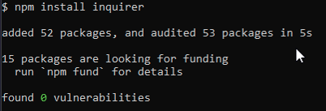

 
 

## Project Title:
Professional README.md generator
 
 

## Description:
This program generates a README.md file automatically based on questions asked
 
 

## Table of Contents:
- [Installation of Inquirer package](#installation)
- [Usage](#usage)
- [License](#license)
- [How to contribute](#contribute)
- [Tests](#tests)
- [Questions](#questions)
- [Credits](#credits)
 
 

## Installation:
npm install inquirer

 
 

## Usage:
node index.js
 
 

## License:
Apache_2.0 license was used for this project
 
 

## Contribute:
Any user can contribute to this open source project
 
 

## Tests:
npm test
 
 

## Questions:
(My Contact info):
 
GitHub username: rakibca

[GitHub Profile](https://github.com/Rakibca)

Email address: rakib.islam@gmail.com
 
 

## Credits:
- [W3Schools](https://www.w3schools.com "W3Schools")
- [MDN Web Docs](https://developer.mozilla.org "MDN Web Docs")
- [Google](https://www.google.com "Google's Homepage")
- [Stack Overflow](https://stackoverflow.com "Stack Overflow website")
- [Shields.io](https://shields.io/)

